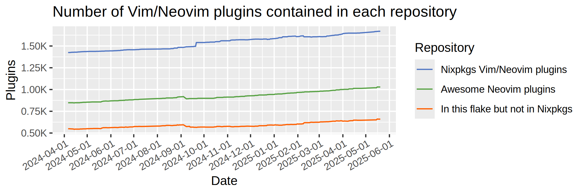

# flake-awesome-neovim-plugins

Nix flake of Awesome Neovim plugins.

[![CI][b1]][b2]
[![Awesome Neovim plugins][b3]][Awesome Neovim]
[![FlakeHub][b4]][b5]

[b1]: https://img.shields.io/github/actions/workflow/status/m15a/flake-awesome-neovim-plugins/check.yml?style=flat-square&logo=github&label=CI
[b2]: https://github.com/m15a/flake-awesome-neovim-plugins/actions/workflows/check.yml
[b3]: https://img.shields.io/badge/Awesome_Neovim_plugins-995-57A143?style=flat-square
[b4]: https://img.shields.io/endpoint?url=https://flakehub.com/f/m15a/flake-awesome-neovim-plugins/badge&style=flat-square
[b5]: https://flakehub.com/flake/m15a/flake-awesome-neovim-plugins



## Description

This repository is a *mirror* of [Awesome Neovim], in a sense that
it as a [Nix flake] provides all Neovim plugins in the Awesome Neovim
collection.

[Awesome Neovim]: https://github.com/rockerBOO/awesome-neovim
[Nix flake]: https://wiki.nixos.org/wiki/Flakes

Packages are automatically updated once every day using GitHub Actions.
This is done by parsing the `README.md` and collecting all plugins
manifested therein.

Since these packages are automatically generated, some of them could be
broken due to lack of appropriate overrides (missing dependencies, build
inputs, etc.). So, you should be careful if you want to use them.

## Usage

### Flake

The overlay adds Awesome Neovim plugins to `pkgs.awesomeNeovimPlugins`.
Use it as you normally do, like so:

```nix
{
  inputs = {
    flake-utils.url = "github:numtide/flake-utils";
    awesome-neovim-plugins.url = "github:m15a/flake-awesome-neovim-plugins";
  };
  outputs = { self, nixpkgs, flake-utils, awesome-neovim-plugins, ... }:
  flake-utils.lib.eachDefaultSystem (system:
  let
    pkgs = import nixpkgs {
      inherit system;
      overlays = [ awesome-neovim-plugins.overlays.default ];
    };
  in {
    packages = {
      your-neovim = pkgs.neovim.override {
        configure = {
          packages.example = with pkgs.awesomeNeovimPlugins; {
            start = [
              ataraxis-lua
            ];
          };
        };
      };
    };
  });
}
```

### FlakeHub

Alternatively, you can use this flake via [FlakeHub].
See instructions at the [FlakeHub page].

[FlakeHub]: https://flakehub.com/
[FlakeHub page]: https://flakehub.com/flake/m15a/flake-awesome-neovim-plugins

## Contributing

### Add a new plugin to this flake

Send a pull request to [Awesome Neovim] in which your favorite plugin
is registered in their `README.md`. Done? Then, wait until the next
plugin updating workflow runs.

### Remove a plugin from this flake

Again, send a pull request to [Awesome Neovim] in which your plugin
is removed from their `README.md`.

### Fix build of a plugin

Send a pull request to this repository in which your fix is applied in
[`./nix/overrides.nix`](nix/overrides.nix).

## Licenses

Unless otherwise stated, this software is licensed under the
[BSD 3-clause license](LICENSE).

A part of [`./nix/overrides.nix`](nix/overrides.nix) is modification
from the original Nixpkgs' code, which is licensed under the MIT license.
See the license terms in comments in the file.

[`./data/plugins/awesome-neovim.json`](data/plugins/awesome-neovim.json)
is collected from various code hosting services by using their API.
Each part of the data has respective copyright and permission to use.
For more information about the permissible data use and content rights,
see each service's terms of use:

- [GitHub](https://docs.github.com/en/site-policy/github-terms/github-terms-of-service)
- [GitLab](https://handbook.gitlab.com/handbook/legal/api-terms/)
- [sourcehut](https://man.sr.ht/terms.md)
- [Codeberg](https://codeberg.org/codeberg/org/src/branch/main/TermsOfUse.md)

Datasets and images in [`./data/stats/`](data/stats/) are contributed
by the same authors declared in the [software license](LICENSE), and
licensed under the [Creative Commons Attribution-ShareAlike 4.0
International license](https://creativecommons.org/licenses/by-sa/4.0/).

<!-- vim:set tw=72 spell nowrap: -->
